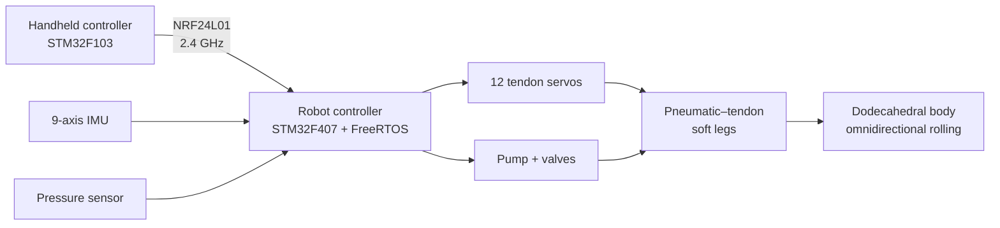

  

   

  <a href="README.md"><strong>English</strong></a> ·
  <a href="README.zh-CN.md">简体中文</a>

    

  
  
  
  
  

## An untethered robot that rolls by changing its own shape

Rolling Robot is a B.Eng. capstone project by **Yufeng Zeng (曾宇烽)** at South China University of Technology. Twelve pneumatic–tendon soft legs are arranged on the faces of a regular dodecahedral body. Coordinated contraction and extension shift the robot's center of mass beyond its support polygon, producing omnidirectional rolling without an external air line.

> This repository contains the embedded firmware, Keil projects, prebuilt binaries, and mechanical source files used for the prototype.

## What makes it different

| | Design choice | Purpose |
|---|---|---|
| **01** | Dodecahedral body with 12 actuated faces | Similar rolling behavior in multiple directions |
| **02** | Pneumatic–tendon coupled soft leg | Tendons provide contraction while air pressure tunes stiffness and extension force |
| **03** | Interconnected three-leg pneumatic circuit | Reuses displaced air during a “two contract, one extends” step |
| **04** | Distributed STM32 control | Separates handheld input from real-time sensing and actuation on the robot |
| **05** | IMU-based state estimation | Identifies the supporting vertices and selects the next motion direction |

## System architecture

The robot-side firmware runs five application tasks connected through FreeRTOS queues:

- `wit_imu` — attitude, supporting-vertex, direction, and velocity estimation
- `nrf_recv` — command reception and set-point updates
- `charge_task` — pressure control with PID-assisted soft PWM
- `move_task` — gait selection and interpolated servo motion
- `nrf_send` — telemetry back to the handheld controller

## Prototype specifications

| Parameter | Value |
|---|---|
| Body geometry | Regular dodecahedron |
| Circumscribed radius | 150 mm |
| Soft legs | 12 |
| Nominal leg travel | 75 mm |
| Actuation | Tendon-driven contraction + pneumatic extension/stiffness control |
| Robot MCU | STM32F407VET6, Cortex-M4, 168 MHz |
| Controller MCU | STM32F103C8T6, Cortex-M3 |
| Wireless link | NRF24L01, 2.4 GHz |
| State sensing | WIT 9-axis IMU |
| Control software | STM32 HAL + FreeRTOS |

## Experimental results

- Peak-window speed on flat ground: **0.267 m/s at 15 kPa**
- Full-run average speed at the same pressure: **0.053 m/s**
- Continuous rolling with a **1 kg payload**, with a measured 43% speed reduction
- Demonstrated locomotion on flat ground, gravel, and grass
- Interconnected pneumatic actuation reduced tendon tension by approximately **34%** and increased extension output force to nearly **3×** the uncoupled case

These values describe the tested prototype and its experimental setup; they are not general performance guarantees.

## Repository map

| Path | Contents |
|---|---|
| [`Code/`](Code/) | STM32CubeMX/Keil firmware for the robot and handheld controller |
| [`Code/RollingRobot/RollingRobot/Task/`](Code/RollingRobot/RollingRobot/Task/) | Robot application tasks and control logic |
| [`Mechanical_Design/`](Mechanical_Design/) | SolidWorks assemblies, printable STL files, and 3MF files |
| [`firmware/`](firmware/) | Prebuilt HEX images for both STM32 targets |
| [`docs/assets/`](docs/assets/) | Repository artwork and documentation assets |

The generated STM32 HAL/CMSIS sources remain in the repository so the projects can be opened without recreating them in STM32CubeMX. Keil object files, build reports, and machine-specific settings are intentionally excluded.

## Build and flash

### Option A — use the prebuilt firmware

Flash the matching image from [`firmware/`](firmware/) with STM32CubeProgrammer or another ST-Link-compatible tool:

- `rolling-robot.hex` — STM32F407VET6 robot controller
- `controller.hex` — STM32F103C8T6 handheld controller

### Option B — build from source

1. Install Keil MDK-ARM with the STM32F1 and STM32F4 device packs.
2. Open the relevant project:
   - Robot: [`Code/RollingRobot/RollingRobot/MDK-ARM/RollingRobot.uvprojx`](Code/RollingRobot/RollingRobot/MDK-ARM/RollingRobot.uvprojx)
   - Controller: [`Code/RollingRobot/Controller/Controller/MDK-ARM/Controller.uvprojx`](Code/RollingRobot/Controller/Controller/MDK-ARM/Controller.uvprojx)
3. Build the target and flash it through ST-Link.

Hardware pin assignments and peripheral initialization are defined in the corresponding `.ioc` files and generated `Core/` sources.

## Mechanical files

The [`Mechanical_Design/Model/`](Mechanical_Design/Model/) directory includes editable SolidWorks parts/assemblies and printable exports. Original filenames are retained because changing them can break assembly references. See the [mechanical design notes](Mechanical_Design/README.md) before reorganizing those files locally.

## Project scope

This is an archived research prototype rather than a plug-and-play kit. Reproduction requires the original electronics, pneumatic components, servo calibration, and mechanical assembly. The repository does not currently include a complete bill of materials or wiring diagram.

## Author and acknowledgment

Developed by **Yufeng Zeng (曾宇烽)** as an undergraduate capstone project at the School of Mechanical and Automotive Engineering, South China University of Technology.

Advisor: **Prof. Yunquan Li (李云泉)**

The pneumatic–tendon coupling concept builds on prior work by Fu et al. on untethered soft rolling robots (IEEE Robotics and Automation Letters, 2024).

## License

No open-source license has been added yet. Unless a license is added, copyright remains with the author and reuse requires permission.
