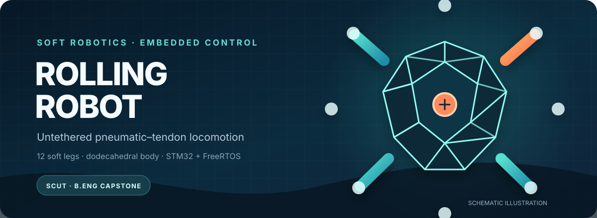
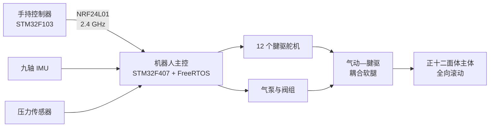

  

   

  <a href="README.md">English</a> ·
  <a href="README.zh-CN.md"><strong>简体中文</strong></a>

## 一台通过改变自身形态实现滚动的无系留机器人

Rolling Robot 是 **曾宇烽（Yufeng Zeng）** 在华南理工大学完成的本科毕业设计。机器人以正十二面体为主体，在 12 个面上布置气动—腱驱耦合软腿。软腿按一定顺序收缩和伸展，使机器人重心越过当前支撑区域，从而在不连接外部气管的情况下实现全向滚动。

> 本仓库收录了样机使用的嵌入式固件、Keil 工程、可直接烧录的固件文件，以及机械设计源文件。

## 核心设计

| | 设计 | 作用 |
|---|---|---|
| **01** | 12 面驱动的正十二面体结构 | 利用几何对称性获得多个方向上较一致的滚动能力 |
| **02** | 气动—腱驱耦合软腿 | 腱驱负责收缩，气压用于调节刚度并提供伸展力 |
| **03** | 三腿互联气路 | 在“两腿收缩、一腿伸展”的步态中复用气体 |
| **04** | 双 STM32 分布式控制 | 手持控制器负责输入，机器人本体负责实时感知与执行 |
| **05** | 基于 IMU 的状态估计 | 识别当前支撑顶点，并据此选择下一步运动方向 |

## 系统架构

机器人端固件包含 5 个通过 FreeRTOS 消息队列协作的应用任务：

- `wit_imu`：姿态、支撑顶点、运动方向和速度估计
- `nrf_recv`：接收遥控指令并更新设定值
- `charge_task`：基于 PID 辅助软 PWM 的压力控制
- `move_task`：步态选择与舵机插值运动
- `nrf_send`：向手持控制器回传状态数据

## 样机参数

| 参数 | 数值 |
|---|---|
| 主体构型 | 正十二面体 |
| 外接球半径 | 150 mm |
| 软腿数量 | 12 |
| 软腿标称行程 | 75 mm |
| 驱动方式 | 腱驱收缩 + 气动伸展与刚度调节 |
| 机器人主控 | STM32F407VET6，Cortex-M4，168 MHz |
| 手持控制器 | STM32F103C8T6，Cortex-M3 |
| 无线通信 | NRF24L01，2.4 GHz |
| 状态感知 | WIT 九轴 IMU |
| 控制软件 | STM32 HAL + FreeRTOS |

## 实验结果

- 15 kPa、平地条件下的峰值窗口速度为 **0.267 m/s**
- 同一工况下，全程平均速度为 **0.053 m/s**
- 搭载 **1 kg 负载**时仍能连续滚动，实测速度下降 43%
- 已在平地、碎石和草地完成运动演示
- 互联气路使腱绳张力降低约 **34%**，伸展腿输出力提升至非耦合工况的近 **3 倍**

上述数据只对应本项目样机及其测试条件，不代表其他复现版本能够达到相同性能。

## 仓库结构

| 路径 | 内容 |
|---|---|
| [`Code/`](Code/) | 机器人本体与手持控制器的 STM32CubeMX/Keil 固件工程 |
| [`Code/RollingRobot/RollingRobot/Task/`](Code/RollingRobot/RollingRobot/Task/) | FreeRTOS 应用任务与主要控制逻辑 |
| [`Mechanical_Design/`](Mechanical_Design/) | SolidWorks 装配体、STL 和 3MF 文件 |
| [`firmware/`](firmware/) | 两个 STM32 目标的预编译 HEX 固件 |
| [`docs/assets/`](docs/assets/) | 仓库展示和文档资源 |

为保证工程可直接在 Keil 中打开，仓库保留了 STM32CubeMX 生成的 HAL/CMSIS 源码；Keil 编译中间文件、构建报告和本机用户配置不纳入版本管理。

## 编译与烧录

### 直接烧录预编译固件

使用 STM32CubeProgrammer 或其他支持 ST-Link 的工具，烧录 [`firmware/`](firmware/) 中对应的文件：

- `rolling-robot.hex`：STM32F407VET6 机器人主控
- `controller.hex`：STM32F103C8T6 手持控制器

### 从源代码编译

1. 安装 Keil MDK-ARM，并配置 STM32F1、STM32F4 芯片支持包。
2. 打开对应工程：
   - 机器人本体：[`Code/RollingRobot/RollingRobot/MDK-ARM/RollingRobot.uvprojx`](Code/RollingRobot/RollingRobot/MDK-ARM/RollingRobot.uvprojx)
   - 手持控制器：[`Code/RollingRobot/Controller/Controller/MDK-ARM/Controller.uvprojx`](Code/RollingRobot/Controller/Controller/MDK-ARM/Controller.uvprojx)
3. 编译后通过 ST-Link 烧录。

硬件引脚和外设初始化信息可在对应的 `.ioc` 文件及 `Core/` 目录中查看。

## 机械设计文件

[`Mechanical_Design/Model/`](Mechanical_Design/Model/) 中包含可编辑的 SolidWorks 零件/装配体和可打印文件。为避免 SolidWorks 装配引用失效，仓库保留了原始文件名；在本地重命名或移动文件前，请先阅读[机械设计说明](Mechanical_Design/README.md)。

## 项目边界

本项目是毕业设计阶段完成的研究样机，并非开箱即用的套件。完整复现仍需要匹配原样机的电子元件、气动元件、舵机标定和装配参数。目前仓库暂未提供完整 BOM 与接线图。

## 作者与致谢

作者：**曾宇烽（Yufeng Zeng）**，华南理工大学机器人学院本科毕业设计。

指导教师：**李云泉 教授**

本项目的气动—腱驱耦合思路参考了 Fu 等人在无系留软体翻滚机器人方面的研究（IEEE Robotics and Automation Letters，2024）。

## 许可说明

本仓库目前尚未添加开源许可证。在许可证补充前，项目版权归作者所有，复用前请先获得许可。
